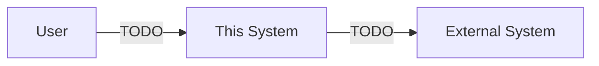
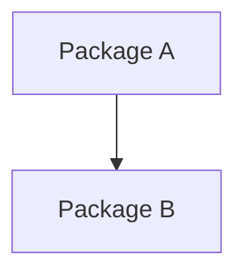
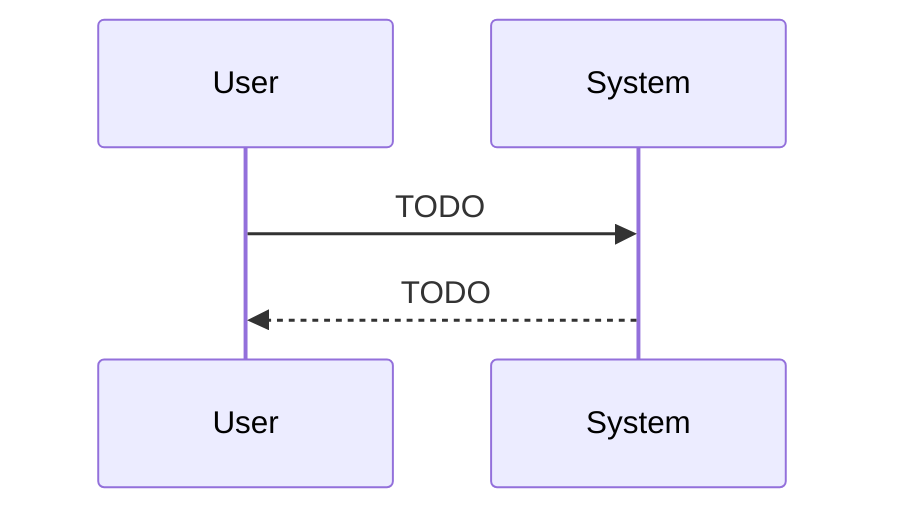
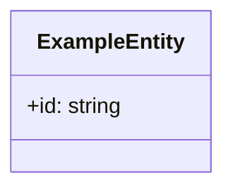
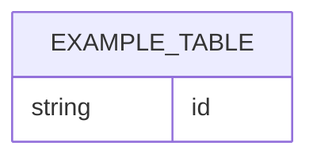
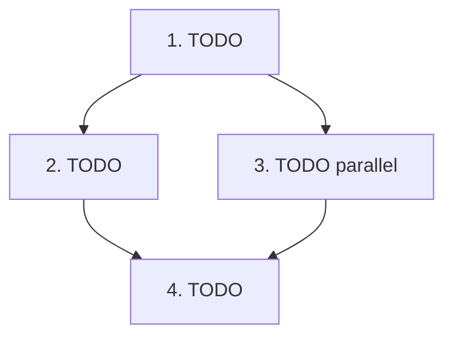

# Plan: ${title}

- Generated: ${date}
- Target directory: ${target_dir}

## 1. 目的 / ゴール

TODO

## 2. スコープ

### 2.1 対象

- TODO

### 2.2 対象外

- TODO

## 3. 前提 / 依存

- TODO

## 4. 変更影響範囲

- TODO

## 5. ディレクトリツリー

作成・編集するファイルのみ。

```text
directory
└─ TODO
    ├─ TODO
    └─ TODO
README.md
.gitignore
```

## 6. 新規追加・変更するファイル一覧

| 種別 | ファイル       | 対応内容 |
| ---- | -------------- | -------- |
| TODO | `path/to/file` | TODO     |

## 7. システム関連図



## 8. パッケージ図



## 9. シーケンス図



## 10. ドメインモデル図



## 11. ER図



## 12. 各パッケージの詳細設計

### 12.1 パッケージ一覧

| パッケージ | 目的/責務 | 主な公開API | 依存 |
| ---------- | --------- | ----------- | ---- |
| TODO       | TODO      | TODO        | TODO |

### 12.2 詳細

#### <package-name>

- 目的/責務: TODO
- 公開API: TODO
- 主要データ構造: TODO
- 主要フロー: TODO
- 依存: TODO
- エラーハンドリング: TODO
- テスト方針: TODO
- 非機能: TODO
- 性能: TODO
- セキュリティ: TODO

## 13. 実装計画

依存関係と実装順序を矢印で表現し、並列可能な箇所は分岐で表現。



## 14. テスト計画

- TODO

## 15. ロールバック / 移行

- TODO

## 16. リリース手順

- TODO

## 17. 受け入れ基準

- TODO

## 18. 未決事項

- TODO
