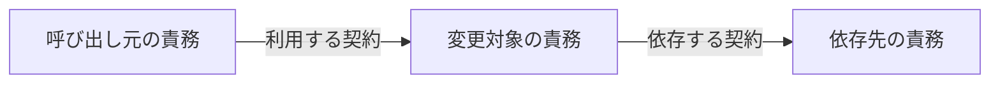
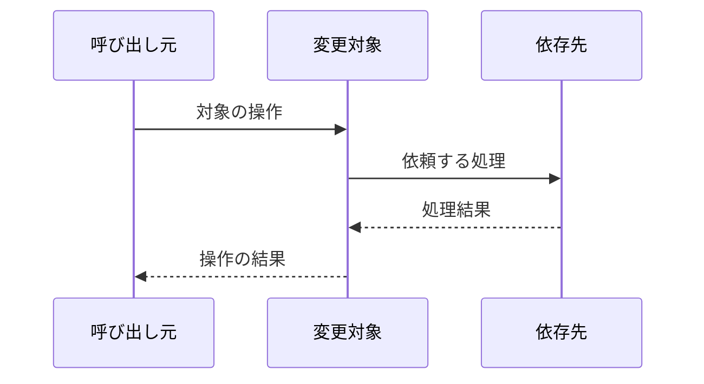
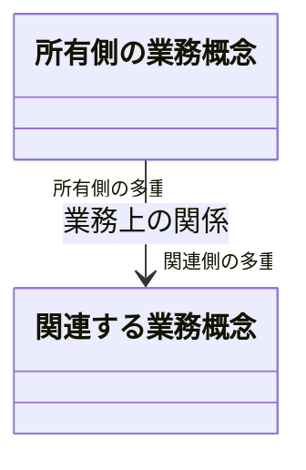
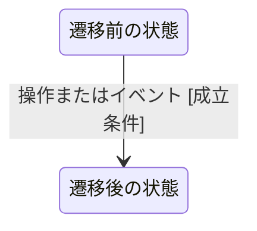
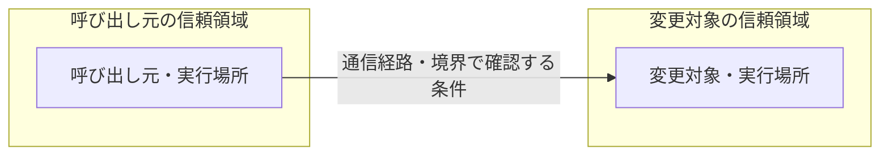
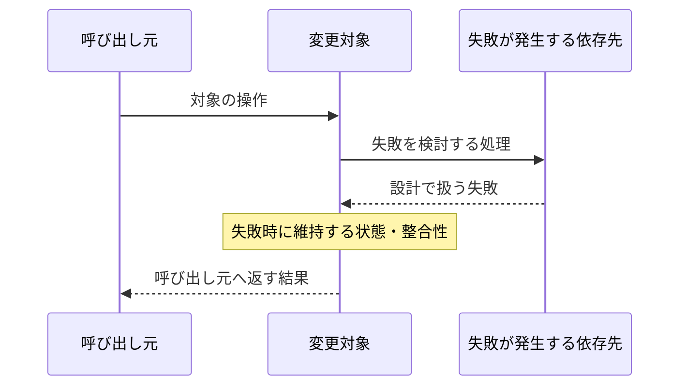

<!--
構造・順序・状態の重要な誤解を減らせる場合だけ、対応する節にGitHub対応のMermaid図を`mermaid`コードブロックで置く。
図は一つの主要な論点と、その理解に必要な変更箇所・周辺だけを示し、文章や表は採用理由と制約を補う。
以下の第3階層見出しとMermaidコードは選択式の雛形。各図の採用条件を見て、必要なものだけ具体化する。
図中の役割名・処理名・関係・条件は、採用した設計の具体名と内容に置換し、登場要素と矢印も対象に合わせて増減する。
文章や表で十分なら図は0枚でよい。使わない図は第3階層見出し・説明・コードブロックごと削除し、省略理由は残さない。
完成した設計には未置換の雛形や記入用コメントを残さない。第2階層の必須見出しは維持する。
-->

## Material Decisions

| 設計判断                      | 根拠                                                        | 採用方式                    | 採用理由                                      |
| ----------------------------- | ----------------------------------------------------------- | --------------------------- | --------------------------------------------- |
| <!-- TODO: 重要な設計判断 --> | <!-- TODO: 要求された成果、成果制約、要件またはシナリオ --> | <!-- TODO: 採用する方式 --> | <!-- TODO: リポジトリの事実に適合する理由 --> |

## Reuse Assessment

<!-- delta Spec Unitがない場合は表を削除し、理由付きで「なし」と記載する。Spec Unitや調査行を捏造しない。 -->

| Spec Unit                   | Reusable Capability                       | Source Classification                                                                                                                                                     | Decision                                                             | Selected Reuse / Version                    | Research Evidence                            | Limited Complement Justification                             |
| --------------------------- | ----------------------------------------- | ------------------------------------------------------------------------------------------------------------------------------------------------------------------------- | -------------------------------------------------------------------- | ------------------------------------------- | -------------------------------------------- | ------------------------------------------------------------ |
| <!-- TODO: specs/<name> --> | <!-- TODO: パッケージで代替可能な能力 --> | <!-- TODO: REPOSITORY_CODE / WORKSPACE_PACKAGE / DIRECT_DEPENDENCY / REPOSITORY_DEPENDENCY / TRANSITIVE_ONLY / NEW_EXTERNAL / EXISTING_UPDATE / NO_REUSABLE_CANDIDATE --> | <!-- TODO: REUSE / ADOPT / UPDATE / REPLACE / LIMITED_COMPLEMENT --> | <!-- TODO: 採用対象と固定版または既存版 --> | <!-- TODO: docs/report/research/...md:行 --> | <!-- TODO: LIMITED_COMPLEMENTだけ代替不能根拠。ほかはN/A --> |

## Boundaries

- <!-- TODO: 責務、依存方向、外部契約の境界を記載する。 -->

### 変更対象の責務と依存関係

<!--
採用条件: 今回の責務分担や依存方向を、文章だけでは読み違える可能性がある。
描く対象: 変更するモジュール・サービス・システムの責務と、その理解に必要な呼び出し元・依存先。
矢印は利用側から提供側へ向け、利用する契約を記す。実行順序は次のシーケンス図で扱う。
-->

### 境界をまたぐ主要な処理

<!--
採用条件: 担当間の呼び出し順序、非同期処理、副作用の実行主体が重要な設計判断である。
描く対象: 対象の操作に参加する担当と、開始から結果が返るまでの重要なやり取り。
同期・非同期・応答の矢印、処理順序、必要な分岐を採用した設計に合わせる。細かな内部処理は描かない。
-->

## Data

- <!-- TODO: データ所有権、整合性、保持、変換を記載する。該当しない場合は理由付きで「なし」と記載する。 -->

### 業務概念とデータの所有関係

<!--
採用条件: 概念間の関係、多重度、所有権がデータの整合性や責務分担を左右する。
描く対象: 今回の設計判断に必要な業務概念と関係。クラス図の箱はコードのクラスやファイルではない。
関係名、多重度、矢印や合成などの関係記号を実際の設計に合わせ、保持する属性も重要なものだけに絞る。
-->

### 変更対象の状態遷移

<!--
採用条件: 許される状態遷移や成立条件を明確にすることが、今回の設計に不可欠である。
描く対象: 対象概念の状態、遷移を起こす操作・イベント、成立条件。必要な状態の不変条件を補足する。
開始・終了状態や分岐は対象のライフサイクルに存在するものだけを描く。
-->

## Security

- <!-- TODO: 信頼境界、認証、認可、入力検証、機密性を記載する。 -->

### 実行場所と信頼境界を越える通信

<!--
採用条件: 実行場所や信頼境界をまたぐ通信について、保護責任の所在を明確にする必要がある。
描く対象: 通信する実行主体、所属する信頼領域、通信経路、境界で確認する認証・認可・検証などの条件。
領域と条件は今回関係するものだけに絞り、責務構成図と同じ情報だけならそちらにまとめる。
-->

## Migration

- <!-- TODO: リポジトリ内で再現可能な移行順序と整合性保護を記載する。 -->

## Rollback

- <!-- TODO: データ損失を防ぐ切り戻し境界と条件を記載する。 -->

## Failure Modes

- <!-- TODO: 重要な失敗、検出方法、安全な振る舞いを記載する。 -->

### 重要な失敗時の伝播と整合性

<!--
採用条件: 境界をまたぐ失敗の伝播や、途中まで実行した処理の状態を文章だけでは読み違える可能性がある。
描く対象: 設計で扱う具体的な失敗の発生箇所、受け取る担当、維持する状態・整合性、呼び出し元が受け取る結果。
同じやり取りをBoundariesの図で示す場合は、そちらの必要な分岐にまとめ、この図を重複させない。
-->

## Risks

- <!-- TODO: 残存リスク、影響、軽減策を記載する。 -->

## Verification

- <!-- TODO: 仕様と設計判断を客観的に確認する方法を、試験階層別の実装計画にせず記載する。 -->

## Revisit Triggers

- <!-- TODO: 各物質的判断を再検討する証拠または条件を記載する。 -->
